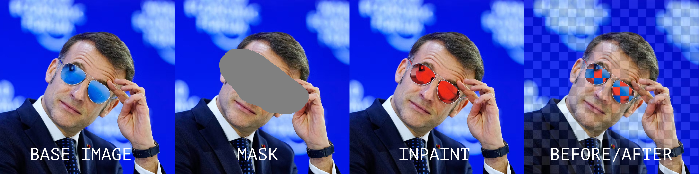

# Aioli Nodes — ComfyUI Custom Node Suite

Three utility nodes for outpainting and inpainting in ComfyUI.

## Installation

### Via ComfyUI Registry (recommended)

Search **"Aioli Nodes"** directly in the ComfyUI Manager → Install Nodes.

### Via Git URL

```
https://github.com/aiolicollective/aioli-nodes
```

### Manual installation

1. Copy the `aioli-nodes` folder into `ComfyUI/custom_nodes/`
2. Restart ComfyUI
3. The nodes appear under the **Aioli Nodes** category

No extra dependencies — only `math` (Python stdlib), `torch` and `Pillow` (already bundled with ComfyUI).

---

## 🖼️ Ratio Outpaint Calc

Prepares an image for outpainting to a standard aspect ratio.  
Automatically computes padding and generates the mask.

**Inputs**
| Parameter | Type | Description |
|-----------|------|-------------|
| image | IMAGE | Source image |
| ratio | dropdown | `none` · `1:1` · `4:5` · `5:4` · `3:4` · `4:3` · `16:9` · `9:16` |

**Outputs**
| Output | Type | Description |
|--------|------|-------------|
| image_padded | IMAGE | Image padded with neutral grey (0.5) |
| mask | MASK | Binary mask (0 = keep, 1 = generate) |

**Workflow**
```
Load Image → 🖼️ Ratio Outpaint Calc → VAE Encode (Inpaint) → KSampler
```

---

## 📐 BBox Multiple Fix

Plugs in right after **Mask Bounding Box** (ComfyUI Essentials).  
Rounds the crop to the chosen multiple and handles scaling (up or down) to a Flux-friendly resolution.

The node ensures the inpainted region stitches back **pixel-perfectly** onto the base image — no border artefacts, no alignment drift, even when the mask zone is at the very edge of the image.

**Example**



*The inpaint applied back onto the base image fits the original contours exactly — pixel-perfect edges, no alignment drift.*

**Inputs**
| Parameter | Type | Description |
|-----------|------|-------------|
| image | IMAGE | Full source image (before crop) |
| mask | MASK | Full source mask (before crop) |
| x | INT | `x` output from Mask Bounding Box |
| y | INT | `y` output from Mask Bounding Box |
| width | INT | `width` output from Mask Bounding Box |
| height | INT | `height` output from Mask Bounding Box |
| multiple | dropdown | `8 (VAE minimum)` · `16 (Flux)` · `32 (SD1.5)` · `64 (SDXL)` |
| target | dropdown | `none` · `512` · `768` · `1024` · `1536` · `2048` |
| force_square | BOOLEAN | Force crop to 1:1 ratio — side = max(width, height). Default: `False` |
| force_target_downscale | BOOLEAN | If bbox > target, downscale toward target (GCD). Default: `False` — fallback to 2048 cap |

**Outputs**
| Output | Type | Description |
|--------|------|-------------|
| image_cropped | IMAGE | Cropped image (scaled if needed) |
| mask_cropped | MASK | Cropped mask (scaled if needed) |
| x | INT | x position for ImageCompositeMasked |
| y | INT | y position for ImageCompositeMasked |
| orig_width | INT | Crop width in source BEFORE scale — use for resize-back after VAE Decode |
| orig_height | INT | Crop height in source BEFORE scale |
| width | INT | Final width after scale |
| height | INT | Final height after scale |
| target_size | INT | Numeric value of target (0 if `none`) — connect directly to ImageResize+ |

**Scaling behaviour**

| Situation | Behaviour |
|-----------|-----------|
| bbox ≤ target | Upscale crop toward target — exact ratio via GCD |
| bbox > target + `force_target_downscale = True` | Downscale crop toward target — exact ratio via GCD |
| bbox > target + `force_target_downscale = False` | Fallback: round to multiple + cap at 2048px |
| target = `none` + bbox > 2048px | Downscale crop to fit 2048px — ratio preserved via GCD |
| `force_square = True` | Crop is squared first (max side), then scaled |

> **Anti-clamp guarantee:** the crop is always constrained to the available space around the bbox center — even when the mask zone is at the image border, the ratio is preserved pixel-perfectly (0% drift).

**Workflow without scale**
```
BBox Fix → VAE Encode → KSampler → VAE Decode → ImageCompositeMasked ← x, y
```

**Workflow with upscale / downscale**
```
BBox Fix → VAE Encode → KSampler → VAE Decode
  │                                      │
  ├── orig_width, orig_height            │
  ├── x, y               ImageResize+ ←─┘
  │                       ↑
  └── target_size ────────┘
                          │
               ImageCompositeMasked ← x, y
```

---

## 🎨 Inpaint Color Fix

Plugs in right after **VAE Decode**, before `ImageResize+` / `ImageCompositeMasked`.

Corrects colorimetric drift introduced by the generation — selectively applies a LAB color match only on pixels that haven't significantly changed, leaving truly creative pixels untouched. No external dependencies (pure numpy + torch).

**Inputs**
| Parameter | Type | Description |
|-----------|------|-------------|
| original_crop | IMAGE | `image_cropped` from BBoxMultipleFix (before KSampler) |
| inpainted_crop | IMAGE | IMAGE from VAE Decode |
| delta_e_threshold | FLOAT | Similarity threshold (-1 = auto). Below = corrected, above = creative/intact |
| blend_strength | FLOAT | Color match strength on similar zones (0 = none, 1 = full) |
| feather_radius | INT | Gaussian blur radius on the correction mask (0 = disabled) |
| mask *(optional)* | MASK | Override mode: bypasses Delta-E entirely, the mask drives correction directly |

**Outputs**
| Output | Type | Description |
|--------|------|-------------|
| image_corrected | IMAGE | Color-corrected crop — connect to ImageResize+ |
| correction_mask | MASK | Debug mask (white = corrected, black = creative/intact) |

**Modes**

| Mode | Behaviour |
|------|-----------|
| No mask connected | Delta-E auto-detects similar vs creative pixels |
| Mask connected | Delta-E is bypassed — the mask controls correction directly |

**Delta-E threshold guide**

| Value | Effect |
|-------|--------|
| `-1` (auto) | Recommended starting point |
| `5–10` | Strict — corrects almost everything except highly creative pixels |
| `15–20` | Balanced — fixes subtle drift, preserves real changes |
| `25–35` | Loose — only corrects near-identical pixels |
| `50+` | Near-global color match |

**Position in workflow**
```
BBoxMultipleFix
  └── image_cropped ──────────────────────────────────┐
                                                       ↓
  └── image_cropped → KSampler → VAEDecode → 🎨 InpaintColorFix → ImageResize+ → ImageCompositeMasked
```

---

## 🔁 Example Workflow — Flux2Klein Inpaint

> **[⬇ Download workflow JSON](examples/WF_Inpaint_aioli-nodes.json)**

A complete, ready-to-use inpaint workflow for **Flux2Klein** (9B), packaged as a ComfyUI subgraph (`FLUX2KLEIN_INPAINT`).

**Required models**
| Role | File |
|------|------|
| UNet | `flux2/flux-2-klein-9b-fp8.safetensors` |
| VAE | `flux2/flux2-vae.safetensors` |
| Text encoder | `qwen_3_8b_fp8mixed.safetensors` |

**Required custom nodes**
- **Aioli Nodes** (this repo) — `BBoxMultipleFix`, `InpaintColorFix`
- **ComfyUI Essentials** — `MaskBoundingBox+`, `ImageResize+`
- **ComfyUI KJNodes** — `GrowMaskWithBlur`
- **rgthree-comfy** — `Image Comparer` (optional, for before/after preview)

**Subgraph inputs**
| Input | Description |
|-------|-------------|
| IMAGE | Source image (with painted mask) |
| MASK | Inpaint mask |
| Resize_Megapixels | Working resolution in megapixels (default: 4) |
| PROMPT | Inpaint prompt |
| Resize_Inpaint_Target | BBox target size (`none` · `512` · `768` · `1024` · `1536` · `2048`) |

**Internal pipeline**
```
LoadImageOutput (with mask painter)
  └→ FLUX2KLEIN_INPAINT subgraph
        ├── ImageScaleToTotalPixels   (resize source to working MP)
        ├── MaskBoundingBox+          (detect mask region)
        ├── BBoxMultipleFix           (crop + scale for Flux, anti-clamp, cap 2048px)
        ├── GrowMaskWithBlur          (soften mask edges)
        ├── VAEEncode × 2 + SetLatentNoiseMask
        ├── CLIPTextEncode → ReferenceLatent → FluxGuidance
        ├── Flux2Scheduler + KSamplerSelect + RandomNoise
        ├── SamplerCustomAdvanced
        ├── VAEDecode
        ├── InpaintColorFix           (selective LAB color match)
        ├── ImageResize+              (resize back to orig_width × orig_height)
        └── ImageCompositeMasked     (stitch result onto source)
  └→ SaveImage + Image Comparer (before / after)
```

**Usage**
1. Download the JSON and drag it into ComfyUI
2. Point `LoadImageOutput` to your image and paint your mask
3. Set your prompt and target resolution in the subgraph inputs
4. Run — the result is composited pixel-perfectly back onto the source image
