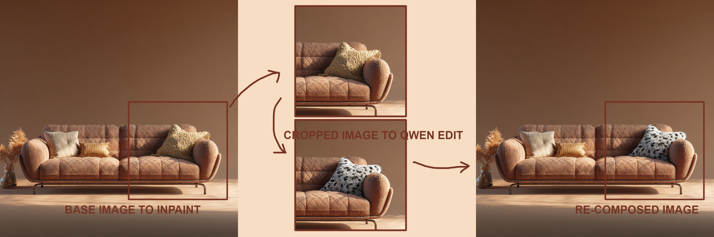

# Aioli Nodes — ComfyUI Custom Node Suite

Three utility nodes for outpainting and inpainting in ComfyUI — plus four ready-to-run example workflows, including three that work out-of-the-box on **ComfyUI Cloud** (no install required).

---

## 💡 Why this approach? (TL;DR)

All workflows in this repo use the same core idea: **inpaint only the masked region, never the whole image**.

- **The source image's dimensions are preserved end-to-end.** Only the crop around the mask goes through the model / KSampler — so the full-resolution original never gets downscaled, stretched, or otherwise degraded to fit a generation budget.
- **More detail inside the masked region.** Since only the crop is generated, the model's entire budget (attention, denoising steps, resolution) is spent on that zone — not diluted across background pixels that aren't changing.
- **`force_square` avoids internal recrops.** Most image-edit models (nano-banana, Flux, Qwen-Edit, SDXL inpaint) quietly recrop or letterbox any non-1:1 input. Forcing the crop to be square before sending prevents this "pixel shift", keeping the output pixel-aligned with the source.
- **Pixel-perfect recompose.** After generation, the result is stitched back onto the untouched source at the exact original coordinates — no drift, no seams, no colour shift at the mask edges.

---

## Installation

### Via ComfyUI Registry (recommended)

Search **"Aioli Nodes"** directly in the ComfyUI Manager → Install Nodes.

### Via Git URL

```
https://github.com/aiolicollective/aioli-nodes
```

### Manual installation

1. Copy the `aioli-nodes` folder into `ComfyUI/custom_nodes/`
2. Restart ComfyUI
3. The nodes appear under the **Aioli Nodes** category

No extra dependencies — only `math` (Python stdlib), `torch` and `Pillow` (already bundled with ComfyUI).

---

## 🖼️ Ratio Outpaint Calc

Prepares an image for outpainting to a standard aspect ratio.  
Automatically computes padding and generates the mask.

**Inputs**
| Parameter | Type | Description |
|-----------|------|-------------|
| image | IMAGE | Source image |
| ratio | dropdown | `none` · `1:1` · `4:5` · `5:4` · `3:4` · `4:3` · `16:9` · `9:16` |

**Outputs**
| Output | Type | Description |
|--------|------|-------------|
| image_padded | IMAGE | Image padded with neutral grey (0.5) |
| mask | MASK | Binary mask (0 = keep, 1 = generate) |

**Workflow**
```
Load Image → 🖼️ Ratio Outpaint Calc → VAE Encode (Inpaint) → KSampler
```

---

## 📐 BBox Multiple Fix

Plugs in right after **Mask Bounding Box** (ComfyUI Essentials).  
Rounds the crop to the chosen multiple and handles scaling (up or down) to a Flux-friendly resolution.

The node ensures the inpainted region stitches back **pixel-perfectly** onto the base image — no border artefacts, no alignment drift, even when the mask zone is at the very edge of the image.

**Example**


*The inpaint applied back onto the base image fits the original contours exactly — pixel-perfect edges, no alignment drift.*

**Inputs**
| Parameter | Type | Description |
|-----------|------|-------------|
| image | IMAGE | Full source image (before crop) |
| mask | MASK | Full source mask (before crop) |
| x | INT | `x` output from Mask Bounding Box |
| y | INT | `y` output from Mask Bounding Box |
| width | INT | `width` output from Mask Bounding Box |
| height | INT | `height` output from Mask Bounding Box |
| multiple | dropdown | `8 (VAE minimum)` · `16 (Flux)` · `32 (SD1.5)` · `64 (SDXL)` |
| target | dropdown | `none` · `512` · `768` · `1024` · `1536` · `2048` |
| force_square | BOOLEAN | Force crop to 1:1 ratio — side = max(width, height). Default: `False` |
| force_target_downscale | BOOLEAN | If bbox > target, downscale toward target (GCD). Default: `False` — fallback to 2048 cap |

**Outputs**
| Output | Type | Description |
|--------|------|-------------|
| image_cropped | IMAGE | Cropped image (scaled if needed) |
| mask_cropped | MASK | Cropped mask (scaled if needed) |
| x | INT | x position for ImageCompositeMasked |
| y | INT | y position for ImageCompositeMasked |
| orig_width | INT | Crop width in source BEFORE scale — use for resize-back after VAE Decode |
| orig_height | INT | Crop height in source BEFORE scale |
| width | INT | Final width after scale |
| height | INT | Final height after scale |
| target_size | INT | Numeric value of target (0 if `none`) — connect directly to ImageResize+ |

**Scaling behaviour**

| Situation | Behaviour |
|-----------|-----------|
| bbox ≤ target | Upscale crop toward target — exact ratio via GCD |
| bbox > target + `force_target_downscale = True` | Downscale crop toward target — exact ratio via GCD |
| bbox > target + `force_target_downscale = False` | Fallback: round to multiple + cap at 2048px |
| target = `none` + bbox > 2048px | Downscale crop to fit 2048px — ratio preserved via GCD |
| `force_square = True` | Crop is squared first (max side), then scaled |

> **Anti-clamp guarantee:** the crop is always constrained to the available space around the bbox center — even when the mask zone is at the image border, the ratio is preserved pixel-perfectly (0% drift).

**Workflow without scale**
```
BBox Fix → VAE Encode → KSampler → VAE Decode → ImageCompositeMasked ← x, y
```

**Workflow with upscale / downscale**
```
BBox Fix → VAE Encode → KSampler → VAE Decode
  │                                      │
  ├── orig_width, orig_height            │
  ├── x, y               ImageResize+ ←─┘
  │                       ↑
  └── target_size ────────┘
                          │
               ImageCompositeMasked ← x, y
```

---

## 🎨 Inpaint Color Fix

Plugs in right after **VAE Decode**, before `ImageResize+` / `ImageCompositeMasked`.

Corrects colorimetric drift introduced by the generation — selectively applies a LAB color match only on pixels that haven't significantly changed, leaving truly creative pixels untouched. No external dependencies (pure numpy + torch).

**Inputs**
| Parameter | Type | Description |
|-----------|------|-------------|
| original_crop | IMAGE | `image_cropped` from BBoxMultipleFix (before KSampler) |
| inpainted_crop | IMAGE | IMAGE from VAE Decode |
| delta_e_threshold | FLOAT | Similarity threshold (-1 = auto). Below = corrected, above = creative/intact |
| blend_strength | FLOAT | Color match strength on similar zones (0 = none, 1 = full) |
| feather_radius | INT | Gaussian blur radius on the correction mask (0 = disabled) |
| mask *(optional)* | MASK | Override mode: bypasses Delta-E entirely, the mask drives correction directly |

**Outputs**
| Output | Type | Description |
|--------|------|-------------|
| image_corrected | IMAGE | Color-corrected crop — connect to ImageResize+ |
| correction_mask | MASK | Debug mask (white = corrected, black = creative/intact) |

**Modes**

| Mode | Behaviour |
|------|-----------|
| No mask connected | Delta-E auto-detects similar vs creative pixels |
| Mask connected | Delta-E is bypassed — the mask controls correction directly |

**Delta-E threshold guide**

| Value | Effect |
|-------|--------|
| `-1` (auto) | Recommended starting point |
| `5–10` | Strict — corrects almost everything except highly creative pixels |
| `15–20` | Balanced — fixes subtle drift, preserves real changes |
| `25–35` | Loose — only corrects near-identical pixels |
| `50+` | Near-global color match |

**Position in workflow**
```
BBoxMultipleFix
  └── image_cropped → KSampler → VAEDecode → 🎨 InpaintColorFix → ImageResize+ → ImageCompositeMasked
```

---

## ☁️ ComfyCloud-compatible workflows (no install required)

If you don't want to install the custom node locally — or if you're running **ComfyUI Cloud** where custom nodes aren't available — there are three pure-subgraph workflows that reproduce the `BBoxMultipleFix` behaviour using only pre-installed nodes.

They all package the same reusable subgraph **`Aioli Node Subgraph — BBox Fix`**, which wires together `MaskBoundingBox+`, `ComfyMathExpression`, `ImageCrop+`, `ImageResize+`, `ImagePadForOutpaint`, `MaskComposite`, `GrowMaskWithBlur`, `SolidMask`, `ImpactSwitch`, `BatchImagesNode`, and `CropMask` to deliver the same features:

- **force_square** · **inpaint_mode** (zone / whole image) · **use_mask_blur**
- **multiple** alignment (with floor-after-clamp, no drift)
- **target_size** (0 = none with 2048 cap, or 512 / 768 / 1024 / 1536 / 2048)
- Anti-clamp guarantee
- Pixel-perfect recompose via `ImageCompositeMasked`
- **Auto 1:1 padding** in whole-image mode (v2): pads source to a square before sending to the model, then strips the padding off — prevents the model from internally recropping non-square images
- **Optional second reference image** (v3, nano-banana only): batch a style-reference image alongside the crop for multi-image prompting — with a `use_image2` toggle that safely bypasses the batch when disabled

### Three flavours, one per inpainting model

#### 🍌 nano-banana (Gemini Image) — v3

The lightest variant: just an API call to Gemini Image, no local diffusion weights needed. Includes the v3 `image2` input for multi-image prompting.

> **[⬇ Download workflow](examples/WF_Inpaint_aioli-subgraph_ComfyCloud_nano-banana.json)**  
> **[🚀 Try it live — "NanoInpaint — CropNStitch" on ComfyUI Cloud](https://cloud.comfy.org/?share=2f8ca539ed1a)** *(optimised for the Cloud app runtime — no setup, just paint & run)*


#### 🌀 Flux.2 Klein 9B

Full local diffusion pipeline using the official ComfyUI Flux.2 Klein inpaint template, combined with the BBox Fix subgraph for pixel-perfect crop & recompose.

> **[⬇ Download workflow](examples/WF_Inpaint_aioli-subgraph_ComfyCloud_Flux2Klein.json)**


#### 🏮 Qwen Image Edit 2511

Same idea as Flux2Klein but using the Qwen Image Edit 2511 template — a different diffusion model, same BBox Fix subgraph wrapper.

> **[⬇ Download workflow](examples/WF_Inpaint_aioli-subgraph_ComfyCloud_QwenImageEdit_2511.json)**



### Subgraph widgets (all three workflows)

| Widget | Default | Purpose |
|---|---|---|
| `force_square` | `True` | Force crop to 1:1 ratio (avoids model-internal recrop) |
| `inpaint_mode` | `True` | `True` = zone mode (crop around mask) · `False` = whole-image mode (pad source to 1:1, send everything, crop back) |
| `use_mask_blur` | `False` | Apply `GrowMaskWithBlur` before bbox detection |
| `multiple` | `16` | Dimension alignment (16/32/64 for VAE; 0/1 disables) |
| `target_size` | `0` | Long-side target: `0` = none (cap 2048) · `512` · `768` · `1024` · `1536` · `2048` |
| `use_image2` *(nano-banana v3 only)* | `False` | Batch a second reference image alongside the crop |

### Running locally?

The nano-banana example uses `LoadImageOutput`, which works out-of-the-box on ComfyUI Cloud but may not be available in some local setups. If you hit an error on load, just replace that node with a standard `Load Image` node — everything else stays the same.

---

## 🔁 Example Workflow — Flux2Klein (custom-nodes version)

> **[⬇ Download workflow JSON](examples/WF_Inpaint_aioli-nodes.json)**

A complete, ready-to-use inpaint workflow for **Flux2Klein** (9B), packaged as a ComfyUI subgraph (`FLUX2KLEIN_INPAINT`).  
This is the **custom-nodes version** — uses `BBoxMultipleFix` and `InpaintColorFix` directly. For a no-install alternative, see the [ComfyCloud workflows](#️-comfycloud-compatible-workflows-no-install-required) above.

**Required models**
| Role | File |
|------|------|
| UNet | `flux2/flux-2-klein-9b-fp8.safetensors` |
| VAE | `flux2/flux2-vae.safetensors` |
| Text encoder | `qwen_3_8b_fp8mixed.safetensors` |

**Required custom nodes**
- **Aioli Nodes** (this repo) — `BBoxMultipleFix`, `InpaintColorFix`
- **ComfyUI Essentials** — `MaskBoundingBox+`, `ImageResize+`
- **ComfyUI KJNodes** — `GrowMaskWithBlur`
- **rgthree-comfy** — `Image Comparer` (optional, for before/after preview)

**Subgraph inputs**
| Input | Description |
|-------|-------------|
| IMAGE | Source image (with painted mask) |
| MASK | Inpaint mask |
| Resize_Megapixels | Working resolution in megapixels (default: 4) |
| PROMPT | Inpaint prompt |
| Resize_Inpaint_Target | BBox target size (`none` · `512` · `768` · `1024` · `1536` · `2048`) |

**Internal pipeline**
```
LoadImageOutput (with mask painter)
  └→ FLUX2KLEIN_INPAINT subgraph
        ├── ImageScaleToTotalPixels   (resize source to working MP)
        ├── MaskBoundingBox+          (detect mask region)
        ├── BBoxMultipleFix           (crop + scale for Flux, anti-clamp, cap 2048px)
        ├── GrowMaskWithBlur          (soften mask edges)
        ├── VAEEncode × 2 + SetLatentNoiseMask
        ├── CLIPTextEncode → ReferenceLatent → FluxGuidance
        ├── Flux2Scheduler + KSamplerSelect + RandomNoise
        ├── SamplerCustomAdvanced
        ├── VAEDecode
        ├── InpaintColorFix           (selective LAB color match)
        ├── ImageResize+              (resize back to orig_width × orig_height)
        └── ImageCompositeMasked      (stitch result onto source)
  └→ SaveImage + Image Comparer (before / after)
```

**Usage**
1. Download the JSON and drag it into ComfyUI
2. Point `LoadImageOutput` to your image and paint your mask
3. Set your prompt and target resolution in the subgraph inputs
4. Run — the result is composited pixel-perfectly back onto the source image

---

## 👋 About

These nodes and workflows are built and maintained by the **aioli collective** — a creative studio exploring what's next for AI-assisted image work.

If this saved you time or inspired something, a ⭐ on the repo goes a long way. You can also follow us to see what we're cooking next:

🌐 [aiolicollective.com](https://aiolicollective.com/) · 📷 [@aioli.collective](https://www.instagram.com/aioli.collective/)

Feedback, bug reports, and pull requests are always welcome via [GitHub Issues](https://github.com/aiolicollective/aioli-nodes/issues).
